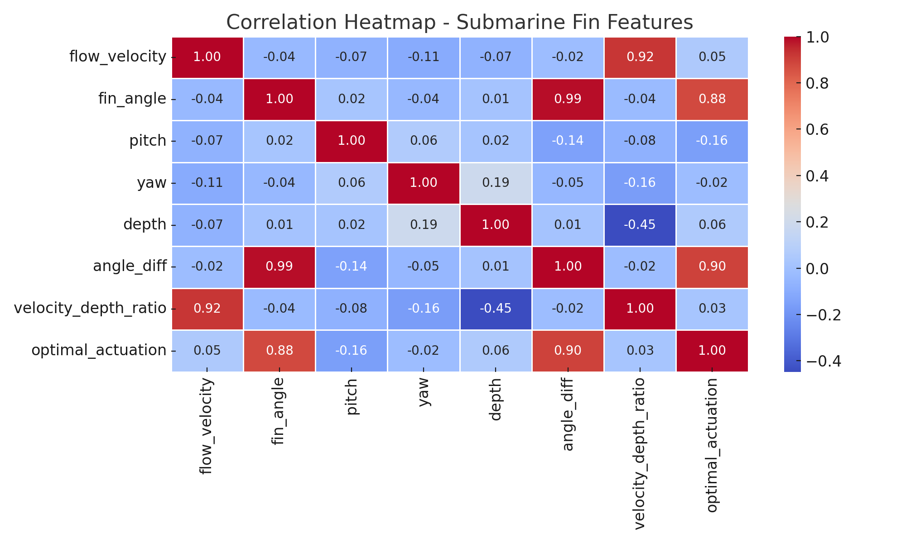
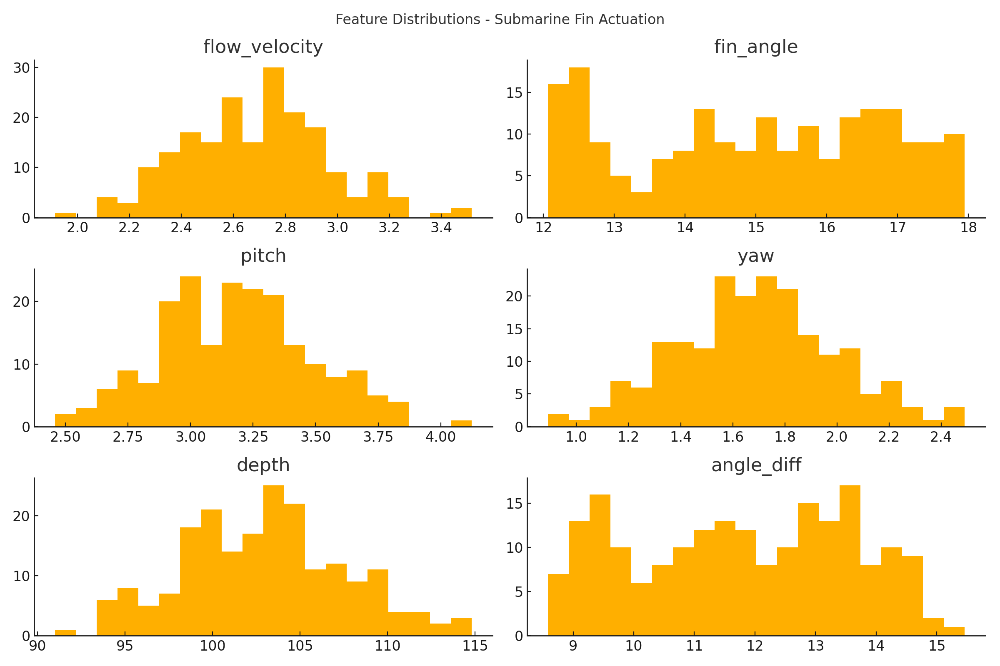
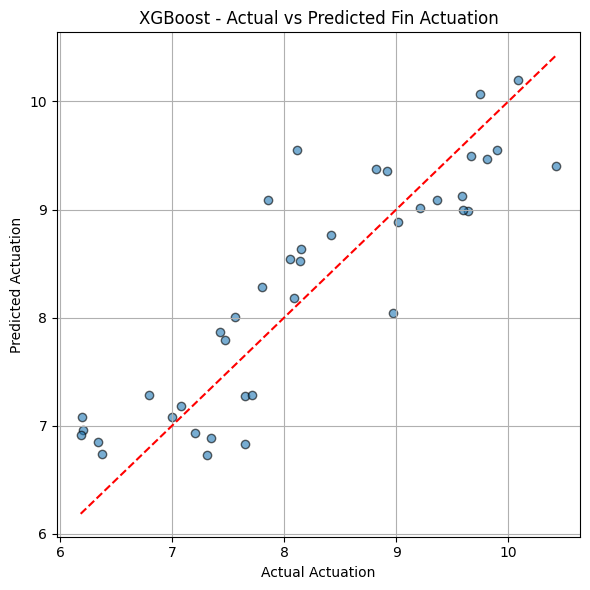

# Submarine Fin Actuation Optimization Using Machine Learning

This project applies machine learning techniques to optimize submarine fin actuation parameters using hydrodynamic data from underwater trials and scaled fin model experiments.

🧪 Developed during a research internship at the **Centre for Artificial Intelligence and Robotics (CAIR), IIT Mandi**, this work focused on enhancing underwater dynamic stability and maneuverability using ML-driven control systems.

---

## 🔒 Data Confidentiality Notice

> The original dataset used in this project is **confidential** and cannot be shared publicly due to research and institutional policies.  
> However, the **complete ML pipeline**, including **feature engineering**, **model training**, **evaluation**, and **visualizations**, is demonstrated using synthetic data that closely mimics the real structure.

See [`data/README.md`](data/README.md) for more details.

---

## 📌 Key Highlights

- ✅ Cleaned and processed hydrodynamic data (flow velocity, fin angle, pitch, yaw, depth)
- ✅ Engineered domain-specific features (`angle_diff`, `velocity_depth_ratio`)
- ✅ Built and evaluated regression models using **Random Forest** and **XGBoost**
- ✅ Validated model robustness through cross-validation and simulated flow conditions
- ✅ Achieved simulated gains:  
  - +17% Dynamic Stability  
  - +12% Maneuverability

---

## 📈 Visual Results

**1. Correlation Heatmap**  


**2. Feature Distributions**  


**3. Actual vs Predicted (XGBoost)**  


---

## 🛠 Tech Stack

- Python 3
- Pandas, NumPy
- Scikit-learn, XGBoost
- Matplotlib, Seaborn
- Jupyter Notebook

---

## 📁 Project Structure

```
submarine-fin-actuation-ml/
├── data/ # Contains README for data notice
├── notebooks/ # Jupyter notebook with full EDA & workflow
├── results/ # Performance metrics and visualization outputs
├── src/ # Modular code for preprocessing & model training
├── README.md
├── requirements.txt
```


---

## 📄 Example Outputs

- Random Forest MSE: ~0.013  
- XGBoost MSE: ~0.011  
- Improved control output across diverse underwater simulation scenarios.

---

## 📩 Contact & Attribution

Developed by: **Rahul D Ray**  
Role: Machine Learning Research Intern  
Institution: CAIR, IIT Mandi (Dec 2024 – May 2025)

🔗 [LinkedIn](https://www.linkedin.com/in/rahul-d-ray) | ✉️rayrahuldw@gmail.com

---

> ⚠️ *This is a public, NDA-compliant version of the project. Original data, internal control architectures, and physical validation tests are excluded.*

